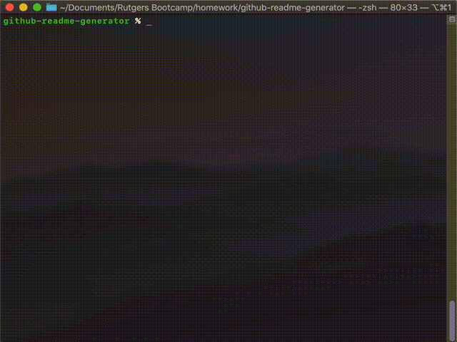

# README.md Generator 

## Description

This is an easy to use github README.md generator using Inquirer.js.

A markdown file will be automatically generated based on user responses. Feel free to use this to create your README.md files for your Github repo.``

## Table of Contents

* [Installation](#installation)
* [Usage](#usage)
* [Credits](#credits)
* [License](#license)
* [Contributing](#contributing)

## Installation

Clone the repo and use Node.js.

## Usage

Install dependencies and follow the onscreen prompts.

```
npm install
node index.js

```




## Credits

none

## License

Licensed under MIT License.

## Contributing

none

## Questions

Contact [mc4506](mailto:mike4506@gmail.com)