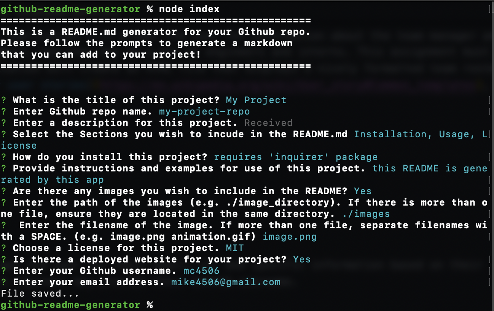

# README.md Generator 

## Description

This is an easy to use github README.md generator using Inquirer.js.

A markdown file will be automatically generated based on user responses. Feel free to use this to create your README.md files for your Github repo.

## Table of Contents

* [Installation](#installation)
* [Usage](#usage)
* [License](#license)

## Installation

Clone the repo and use Node.js to run the index.js file

## Usage

Follow the onscreen prompts.

## License

Licensed under MIT License.

## Questions

Contact [mc4506](mailto:mike4506@gmail.com)